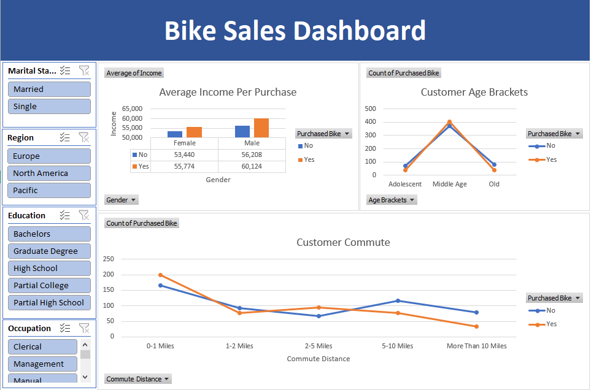
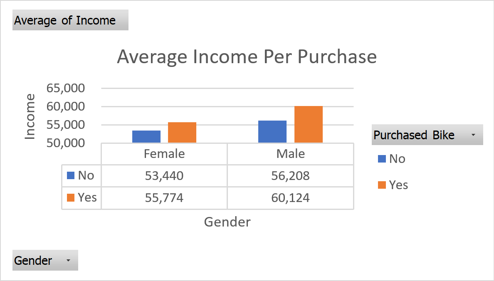
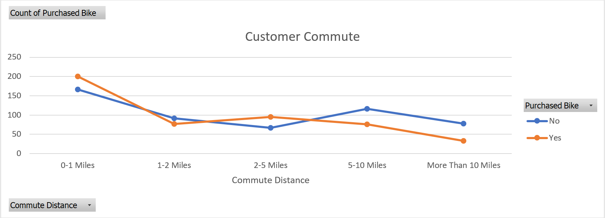
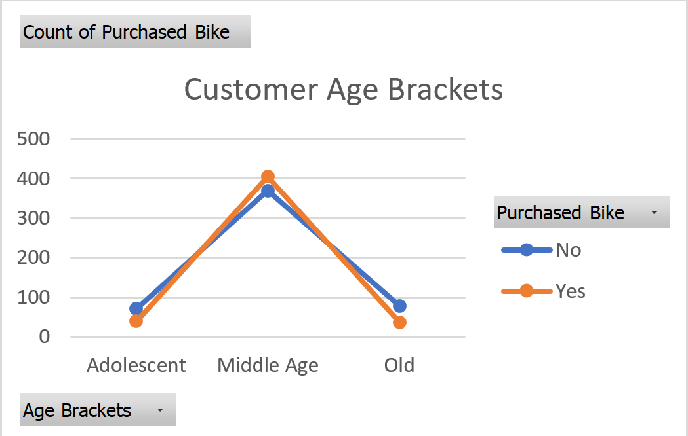

# Bike Sales – Excel Dashboard
This project analyzes bike sales data using Excel.
It includes data cleaning, feature engineering, pivot tables, and dashboards to discover which customers are more likely to purchase a bike.

  

---

## Data Preparation
Steps performed before analysis:

Cleaned categorical values (e.g., standardized commute bands).
Removed duplicates and checked for missing values.
Created a new feature: Age Brackets (Adolescent, Middle Age, Old).
Converted “Purchased Bike” into consistent Yes/No flags.
Structured data in a Working Sheet ready for pivot tables.

---

## Key Insights
Income & Gender
Buyers of both genders tend to have higher average income than non-buyers.
Male buyers have the highest average income overall.

  

---

## Commute Distance
Customers with short commutes (0–1 miles) are the most likely to purchase bikes.
Purchase likelihood drops sharply beyond 5 miles.

  

---

## Age Brackets
Middle-aged customers are the main group of bike buyers.
Adolescents and older customers are significantly less likely to purchase.

  

